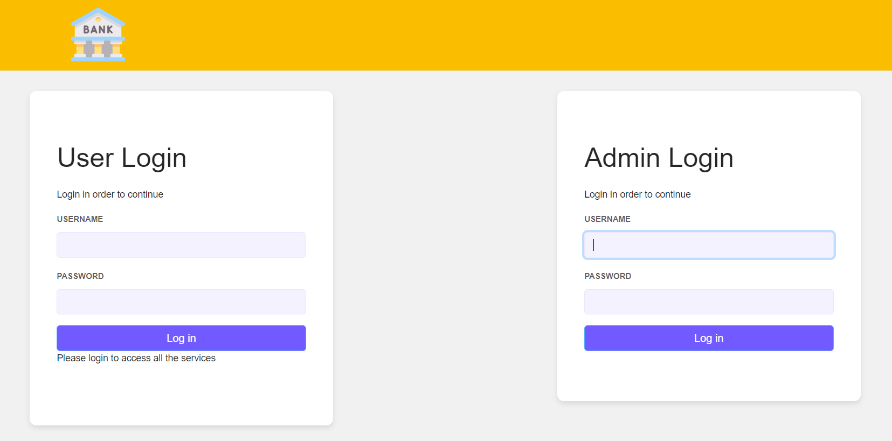

# Bank's Portal powered by Affinidi API

This is a react application that is used by both the client and the verifier. It has a client/user portal which can be used by users to select the required function and submit the necessary documents. In our use case, the user selects 'Applying for loan' feature. The verifier portal is used by the verifier to set the documents criteria for the loan feature and also to verify the authenticity of the documents submitted by the user.
## Installation

## Pre-requisite
- [npm](https://www.npmjs.com/get-npm)

## Installation

`npm install`

Install using npm instead of yarn because the current package-lock.json was
generated using npm.

## Available Scripts

In the project directory, you can run:

### `npm start`

Runs the app in the development mode.\
Open [http://localhost:3002](http://localhost:3002) to view it in the browser(assuming that the issuer and holder application is running on PORT 3000 and 3001 respectively).

The page will reload if you make edits.\
You will also see any lint errors in the console.

### `npm test`

Launches the test runner in the interactive watch mode.\
See the section about [running tests](https://facebook.github.io/create-react-app/docs/running-tests) for more information.

### `npm run build`

Builds the app for production to the `build` folder.\
It correctly bundles React in production mode and optimizes the build for the best performance.

The build is minified and the filenames include the hashes.\
Your app is ready to be deployed!

See the section about [deployment](https://facebook.github.io/create-react-app/docs/deployment) for more information.

## Steps to Issue Credentials:

### Prepare issuer portal
1. Clone the repository
`https://github.com/Anushka3174/Bank-as-Web-Portal-Verifier.git`
3. Install the dependencies
`npm install`
4. Open up the repository in a code editor of your choice

### Running the application

1. Run with npm
`npm start` and opens
2. The web app will run on 'http://localhost:3002/' (assuming that the issuer and holder application is running on PORT 3000 and 3001 respectively). Two login screens can be will be seen as shown in the .
3. Use the given credential: Username:Bankasverifier Password: Pass1234 for verifier portal and Username: applicantHolder Password:Pass1234 for user portal.
4. When logged in as the verifier, you can set the document criteria for the loan function and also check the authenticity of the submitted document token.
5. When logged in as the user, they can select the required feature which then redirects user to the holder wallet running on PORT 3001. Here user can select the  required documents and create a token which can be copied and sent to a verifier where its authentication is verified.
6. The user can then be granted loan if the submitted documents pass the cryptographic proof or else the application request is declined.
